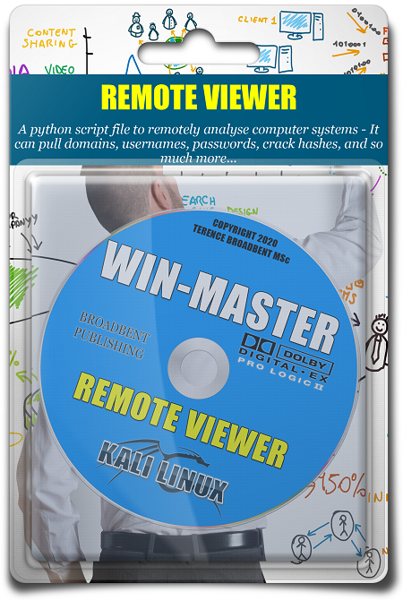

# MASTER CONTROL PROGRAM

## A PYTHON SCRIPT FILE TO REMOTELY ANALYSE COMPUTER SYSTEMS.

TESTED: Kali Linux 2019  
USAGE : python3 mcp.py

| LANGUAGE  | FILENAME   | MD5 Hash                         | Version      |
|------     |------      | -------                          | ----         |
| bash      | install.sh | 1c32cc4def5f2ba9de67271618557f0d | Al@N_3r@dL3y |
| python3   | mcp.py     | a209c3ee0e23536d70961df69efe9cd5 | Al@N_3r@dL3y |

   />

**INSTALL OPTIONS**

        MASTER CONTROL PROGRAM - BASIC INSTALLATION
        -------------------------------------------
        bash install.sh

        BLOODHOUND - INSTALLATION
        -------------------------
        apt-get install bloodhound
        pip3 install aclpwn
        pip3 install bloodhound
        pip3 install neo4j-driver===1.7.6 

     	              
A python script file to remotely analyse computer systems - It can pull domains, usernames, passwords, crack hashes, and so much more...

## COMPUTER MISUSE ACT 1990 - SECTION 3A
This software program has been specifically written for the purpose of legitimate penetration testing and should not be used for any other unauthorised or nefarious reasons.

### CONSOLE DISPLAY AND VIDEO LINK

Found this project useful, or would like to see it amended in some way - make a donation.
https://paypal.me/TerenceBroadbent
